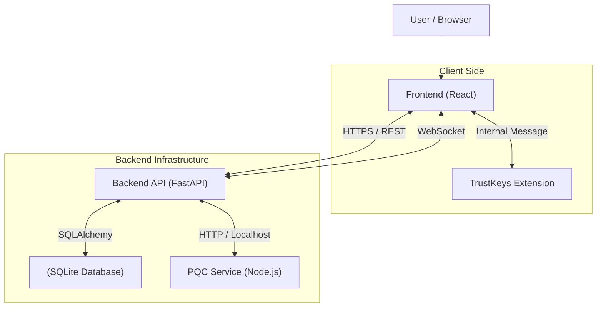

# Safelog Architecture Overview

## 1. High-Level Architecture

Safelog is a secure, Post-Quantum Cryptography (PQC) ready document signing and messaging application. It employs a modular architecture designed to isolate cryptographic keys and sensitive operations.

### Components

The system consists of four main components:

1.  **Frontend (React/Vite)**: The user interface. It manages application state, user interactions, and visualizes encrypted data. It **never** handles private keys directly in memory if the extension or local vault is used safely.
2.  **Backend (FastAPI)**: The central server. It handles business logic, database persistence (SQLite), and API routing. It stores *encrypted* data and facilitates communication between users. It enforces authentication via PQC signatures.
3.  **PQC Service (Node.js)**: A sidecar microservice. It handles heavy Post-Quantum Cryptographic operations (Crystals-Dilithium signing/verification) that are performance-critical or require specific libraries not easily available in Python.
4.  **TrustKeys Extension (Chrome/Firefox)**: A browser extension that acts as a secure wallet. It generates and stores PQC private keys (Kyber & Dilithium) within the isolated extension storage, preventing XSS attacks from compromising user identity.

### Architecture Diagram

## 2. Component Details

### Frontend Application
*   **Tech Stack**: React 18, Vite, TailwindCSS.
*   **Role**: UI/UX, Context Management (`AuthContext`, `PQCContext`), API Consumption.
*   **Key Security Feature**: Utilizes a `VaultService` for local key management (fallback) but prefers `window.trustkeys` if available.

### Backend API
*   **Tech Stack**: Python 3.10+, FastAPI, SQLAlchemy.
*   **Role**: 
    *   Auth Orchestration (Challenge-Response with Nonces).
    *   Data Persistence (Users, Secrets, Workflows, Messages).
    *   Access Control (RBAC based on ownership).
    *   Real-time updates via WebSockets (`/ws`).

### PQC Service
*   **Tech Stack**: Node.js, crystals-dilithium library.
*   **Role**: 
    *   Server-side signing (for JWTs).
    *   Verifying client signatures (Login requests).
    *   Serves as the "Root of Trust" for the backend's identity.

### TrustKeys Extension
*   **Tech Stack**: Vanilla JS (Background Service Worker), Content Scripts.
*   **Role**: 
    *   **Key Storage**: `chrome.storage.local` encrypted with user password.
    *   **Isolation**: Private keys never leave the extension execution context.
    *   **Operations**: Sign, Encrypt, Decrypt, Session Key Management.

## 3. Data Flow & Security Model

### Authentication Flow
1.  **Client** requests a random `nonce` for their public key (Address).
2.  **Backend** generates nonce and stores it with expiry.
3.  **Client** signs `Sign in to Secure Log App with nonce: <nonce>` using their Private Dilithium Key (via Extension or Local Vault).
4.  **Backend** verifies signature against the Public Key (using PQC Service).
5.  **Backend** issues a JWT Access Token, signed by the Server's PQC Key (via PQC Service).

### End-to-End Encryption (E2EE)
*   **Standard Secrets**: Encrypted client-side using a random AES Session Key, which is then encrypted (Wrapped) with the User's Kyber Public Key.
*   **Sharing**: To share a secret, the owner unwraps the Session Key, then re-wraps it with the Recipient's Kyber Public Key. The Backend only stores the *Encrypted Key* (`AccessGrant`).
*   **Messaging**: Messages are encrypted with a fresh Session Key per conversation or message (depending on exact implementation version), wrapped for the recipient.

## 4. Database Schema Overview

*   **Users**: Stores Public Keys (Dilithium Address + Kyber Encryption Key).
*   **Secrets**: Stores the encrypted payload (metadata + ciphertext).
*   **AccessGrants**: Impact table linking `User` and `Secret` with the specific `encrypted_key` for that user.
*   **Messages**: Stores transient encrypted communications.
*   **MultisigWorkflows**: Manages state for complex approval flows, linking multiple `Signers` to a target `Secret`.
