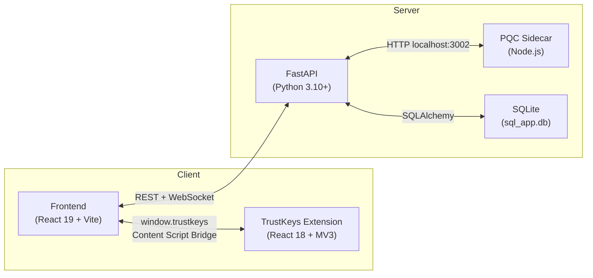
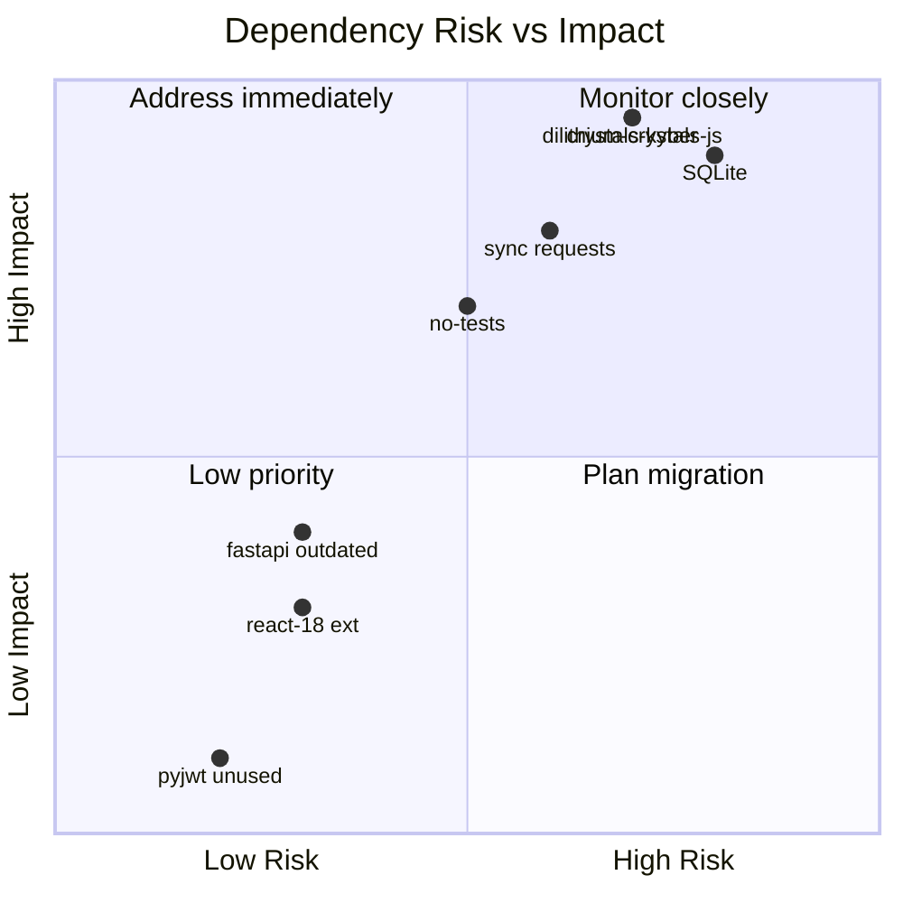

# Safelog — Dependency Analysis & Improvement Suggestions

**Date**: 10 February 2026

---

## 1. Dependency Inventory

### Backend — Python ([requirements.txt](file:///home/bakaneko/safelog/backend/requirements.txt))

| Package | Version | Role | Status |
|---------|---------|------|--------|
| `fastapi` | 0.109.0 | Web framework | ⚠️ **Outdated** — current stable is **0.115.x** |
| `uvicorn` | 0.27.0 | ASGI server | ⚠️ **Outdated** — current is **0.34.x** |
| `sqlalchemy` | 2.0.25 | ORM | ⚠️ Minor behind — current is **2.0.36+** |
| `pyjwt` | 2.10.1 | JWT (decode only, not used for signing) | ✅ Recent |
| `pydantic` | 2.5.3 | Validation | ⚠️ Behind — current is **2.10.x** |
| `eth-account` | 0.11.0 | Ethereum signing (legacy MetaMask path) | ✅ OK |
| `web3` | 6.15.1 | Ethereum interaction | ✅ OK |
| `python-multipart` | 0.0.9 | Form parsing | ⚠️ **Outdated** — renamed to `0.0.18+` |
| `requests` | 2.31.0 | HTTP client (→ PQC service) | ⚠️ Behind — current is **2.32.x** |
| `slowapi` | 0.1.9 | Rate limiting | ✅ OK |

> [!WARNING]
> **Missing**: No pinned `alembic` for DB migrations, no `httpx` (async HTTP), no `pytest` / testing framework.

---

### Backend — PQC Node.js Service ([package.json](file:///home/bakaneko/safelog/backend/package.json))

| Package | Version | Role |
|---------|---------|------|
| `dilithium-crystals-js` | ^1.1.3 | Dilithium PQC signing/verify |
| `dotenv` | ^17.2.3 | Env config |

> [!IMPORTANT]
> Only **2 dependencies** — minimal attack surface. ✅ Good.  
> But uses raw `http.createServer` — no Express, no input sanitization middleware.

---

### Frontend ([package.json](file:///home/bakaneko/safelog/frontend/package.json))

| Package | Version | Role | Notes |
|---------|---------|------|-------|
| `react` | ^19.2.0 | UI framework | ✅ Latest |
| `react-dom` | ^19.2.0 | DOM renderer | ✅ Latest |
| `vite` | ^7.2.4 | Bundler | ✅ Latest |
| `tailwindcss` | ^4.1.17 | Styling | ✅ Latest (v4) |
| `crystals-kyber` | ^5.1.0 | PQC key encapsulation | ⚠️ Niche lib — verify maintenance |
| `dilithium-crystals-js` | ^1.1.3 | PQC signing | ⚠️ Same — verify maintenance |
| `ethers` | ^6.15.0 | Ethereum (MetaMask legacy) | ✅ OK |
| `@metamask/eth-sig-util` | ^8.2.0 | MetaMask sig utils | ✅ OK |
| `lucide-react` | ^0.555.0 | Icons | ✅ OK |
| `buffer` | ^6.0.3 | Node Buffer polyfill | ✅ Required for crypto |
| `clsx` / `tailwind-merge` | latest | CSS utilities | ✅ OK |

> [!NOTE]
> **No router** (react-router). The app uses a single-page dashboard pattern with sidebar navigation. This works for the current scale but limits deep-linking & browser history.

---

### TrustKeys Extension ([package.json](file:///home/bakaneko/safelog/trustkeys/package.json))

| Package | Version | Role | Notes |
|---------|---------|------|-------|
| `react` | ^18.3.1 | Popup UI | ⚠️ **React 18** while frontend uses **React 19** |
| `react-dom` | ^18.3.1 | DOM | ⚠️ Version mismatch with frontend |
| `crystals-kyber` | ^5.1.0 | Kyber KEM | Same as frontend ✅ |
| `dilithium-crystals-js` | ^1.1.3 | Dilithium signing | Same as frontend ✅ |
| `@crxjs/vite-plugin` | ^2.2.1 | Extension bundler | ✅ OK |

---

## 2. Architecture & Functionality Summary

### Core Features

| Feature | Description | Maturity |
|---------|-------------|----------|
| **PQC Authentication** | Challenge-response with Dilithium signatures, PQC-signed JWTs | ✅ Solid |
| **Secret Vault** | E2EE secrets with Kyber key wrapping | ✅ Solid |
| **Secret Sharing** | Re-wrap session key for recipient's Kyber public key | ✅ Solid |
| **Multisig Workflows** | N-of-N signature collection with key release on completion | ✅ Functional |
| **E2EE Messaging** | Encrypted messages with WebSocket real-time delivery | ✅ Functional |
| **Local Vault Fallback** | Browser-side LocalStorage vault (password-encrypted) | ⚠️ Less secure than extension |
| **Document Signing** | Hash + Dilithium signature storage | ✅ Basic |
| **Key Recovery** | Google OAuth-based MPC share recovery | ⚠️ Partial |
| **Biometric Auth** | WebAuthn-based vault unlock | ⚠️ Partial |

---

## 3. Security Suggestions

### 🔴 Critical

| Issue | Location | Suggestion |
|-------|----------|------------|
| **SQLite in production** | [database.py](file:///home/bakaneko/safelog/backend/database.py) | SQLite has no auth, no encryption-at-rest, file-level locking. **Migrate to PostgreSQL** with `asyncpg`. |
| **Synchronous PQC calls** | [auth.py](file:///home/bakaneko/safelog/backend/auth.py#L42-L73) | Every JWT decode calls the PQC service **synchronously** via `requests.post()`. Under load, this blocks the entire event loop. **Switch to `httpx.AsyncClient`**. |
| **No HTTPS enforcement** | [main.py](file:///home/bakaneko/safelog/backend/main.py#L28-L29) | `Strict-Transport-Security` is commented out. **Enable HSTS** in production. |
| **CORS wildcard methods/headers** | [main.py](file:///home/bakaneko/safelog/backend/main.py#L51-L52) | `allow_methods=["*"]` and `allow_headers=["*"]` — should be restricted to only the methods and headers actually used. |
| **PQC service on plain HTTP** | [pqc_service.js](file:///home/bakaneko/safelog/backend/pqc_service.js) | Inter-service communication uses unencrypted HTTP with a static API key. On shared hosting, this traffic could be sniffed. Consider **Unix sockets** or **mTLS**. |
| **No Content-Security-Policy** | [main.py](file:///home/bakaneko/safelog/backend/main.py#L21-L30) | Missing `Content-Security-Policy` header. Add strict CSP to prevent XSS. |

### 🟡 Important

| Issue | Location | Suggestion |
|-------|----------|------------|
| **No DB migrations tool** | `backend/` | No Alembic. Schema changes require manual DB recreation → **data loss risk**. Add Alembic. |
| **No test suite** | Project-wide | Zero automated tests. Add `pytest` + `pytest-asyncio` for backend, `vitest` for frontend. |
| **JWT token has no `jti` (ID)** | [auth.py:create_access_token](file:///home/bakaneko/safelog/backend/auth.py#L90-L123) | No token ID → **cannot revoke individual tokens**. Add `jti` claim and a revocation list. |
| **No refresh token** | Auth flow | Single 30-min access token. User must re-sign with PQC on every expiry — bad UX. Add refresh tokens. |
| **`update_public_key` unauthenticated input** | [users.py:update_public_key](file:///home/bakaneko/safelog/backend/routers/users.py#L14-L19) | The `public_key` is a raw query param, not a Pydantic model — no `max_length` validation. |
| **Nonce cleanup is lazy** | [auth.py (router)](file:///home/bakaneko/safelog/backend/routers/auth.py#L17-L18) | Expired nonces are cleaned per-request. Under no traffic, stale nonces accumulate. Add a periodic cleanup task. |
| **WebSocket auth is post-connect** | [messenger.py:websocket_endpoint](file:///home/bakaneko/safelog/backend/routers/messenger.py#L202-L244) | WS is accepted first, then token validated. An attacker can open unlimited WS connections before auth fails. Validate token **before** `websocket.accept()`. |

### 🟢 Low / Cosmetic

| Issue | Suggestion |
|-------|------------|
| `pyjwt` imported but not used for signing | Remove if only used for decoding (currently PQC handles JWT entirely). Reduces attack surface. |
| `X-XSS-Protection` header | Deprecated in modern browsers. Can be removed; CSP is the proper replacement. |
| `orm_mode = True` in Pydantic v2 schemas | Deprecated in Pydantic v2. Replace with `model_config = ConfigDict(from_attributes=True)`. |

---

## 4. Functionality Suggestions

### High Impact

| Suggestion | Benefit |
|------------|---------|
| **Add React Router** | Enable deep-linking, shareable URLs (e.g., `/secrets/42`), proper browser back/forward. |
| **File attachments for secrets** | Currently only text secrets. Allow encrypted file upload/download with streaming. |
| **Audit log / activity trail** | Track who accessed what, when. Critical for enterprise compliance (SOC2, ISO 27001). |
| **Secret expiration & auto-delete** | `AccessGrant.expires_at` exists in the model but isn't enforced server-side. Implement TTL enforcement. |
| **Group messaging** | Currently only 1-to-1. Add encrypted group channels for team use. |
| **Secret versioning** | Allow updating a secret while keeping history (diff of who changed what). |

### Medium Impact

| Suggestion | Benefit |
|------------|---------|
| **Pagination on `/secrets`** | [get_secrets](file:///home/bakaneko/safelog/backend/routers/secrets.py#L41-L56) returns ALL secrets. Will degrade with scale. Add `limit`/`offset`. |
| **Search/filter secrets** | Allow searching by name, type, date. |
| **Notifications system** | Currently only WS for messages. Add notifications for shared secrets, multisig requests, grant expirations. |
| **Two-factor recovery** | Google OAuth alone for MPC recovery is a single point of failure. Add TOTP/hardware key as second factor. |
| **Firefox Add-on signing** | `manifest.json` includes `browser_specific_settings.gecko` but the extension is likely untested on Firefox. Verify cross-browser compatibility. |

---

## 5. Stack Improvement Suggestions

### Backend

| Current | Suggested | Rationale |
|---------|-----------|-----------|
| **SQLite** | **PostgreSQL + asyncpg** | Concurrent writes, row-level locking, encryption-at-rest, proper prod DB. |
| **`requests` (sync)** | **`httpx` (async)** | FastAPI is async — using sync `requests` blocks the event loop on PQC calls. |
| **No ORM migrations** | **Alembic** | Safe schema evolution without data loss. |
| **No caching** | **Redis** | Cache nonces, rate-limit counters (instead of in-memory `slowapi`), session state, pub/sub for WebSocket scale-out. |
| **Single Node.js PQC process** | **PM2 cluster** or **rewrite in Rust/C** | Node.js is single-threaded. PQC sign/verify is CPU-intensive. Either cluster with PM2 or use a native PQC lib. |
| **No containerization** | **Docker Compose** | Bundle FastAPI + PQC service + PostgreSQL + Redis in a reproducible stack. |
| **No CI/CD** | **GitHub Actions** | Automated testing, linting, security scanning (e.g., `pip-audit`, `npm audit`). |

### Frontend

| Current | Suggested | Rationale |
|---------|-----------|-----------|
| **No router** | **React Router v7** | Deep-linking, code splitting per route, better UX. |
| **No state management** | **Zustand** or **Jotai** | Contexts work now, but won't scale well with more features. Lighter than Redux. |
| **No error boundary** | **React Error Boundaries** | Unhandled crypto errors crash the whole app. Wrap critical sections. |
| **No i18n** | **react-intl** or **i18next** | App already has French-speaking users but UI is English-only. |
| **Large component files** | Decompose (e.g., `Dashboard.jsx` = 16KB, `MultisigWorkflow.jsx` = 33KB) | Better testability, code review, lazy loading. |

### TrustKeys Extension

| Current | Suggested | Rationale |
|---------|-----------|-----------|
| **React 18** | **Upgrade to React 19** | Align with frontend to share components and reduce maintenance burden. |
| **Monolithic `App.jsx` (20KB)** | **Component decomposition** | Single file handles all popup UI logic — hard to maintain. |
| **No automated testing** | **Jest + WDIO** | Extension behavior is hard to QA manually. Add integration tests. |
| **`externally_connectable` localhost only** | **Parameterize for prod** | Ensure production builds strip `localhost` from manifest. |

### Crypto Libraries

> [!CAUTION]
> Both `crystals-kyber` (npm) and `dilithium-crystals-js` are **community-maintained** packages with relatively low download counts. They are not from NIST or a major crypto vendor. Consider:
> 1. **Auditing** these libraries (or commissioning a third-party audit).
> 2. Watching for **official NIST PQC implementations** (e.g., `liboqs` via WASM bindings from the Open Quantum Safe project) as they mature.
> 3. Adding **KAT (Known Answer Tests)** to your CI to catch silent regressions in these libraries after updates.

---

## 6. Dependency Risk Matrix

---

## 7. Recommended Priority Order

1. **Add automated tests** (pytest + vitest) — validates everything below
2. **Switch `requests` → `httpx`** — unblocks async, immediate perf win
3. **Add Alembic** — enables safe DB schema changes
4. **Upgrade FastAPI / Pydantic** — security patches, deprecation fixes
5. **Migrate SQLite → PostgreSQL** — production readiness
6. **Add Docker Compose** — reproducible deployments
7. **Audit PQC crypto libraries** — supply chain security
8. **Add React Router + code-split** — UX and performance
9. **Add Redis** — caching, pub/sub, distributed rate limiting
10. **Implement CI/CD** — automated quality gates
